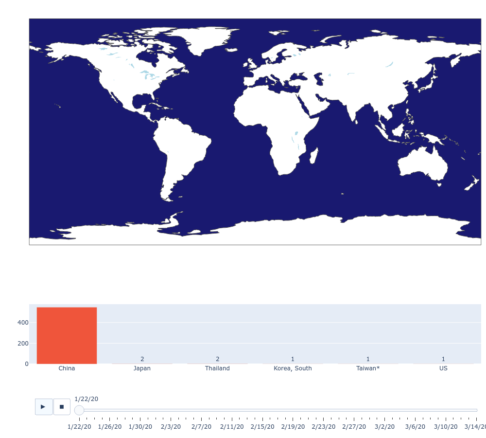
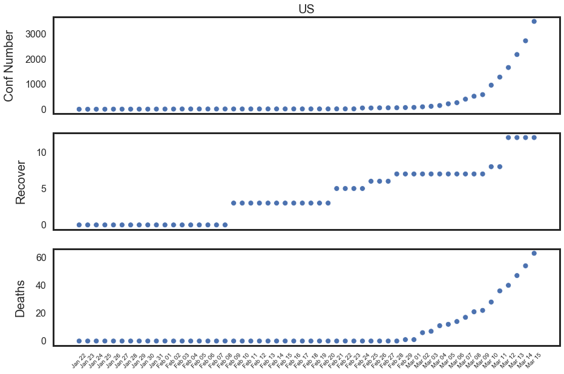
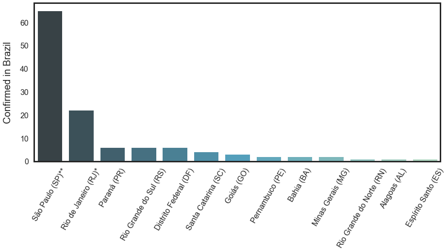

# COVID19-dataset

  Data analysis using the COVID-19 from Johns Hopkins University and Brazilian government.

- Animation of disease spread through the world:
 

- Interactive visualization with ipywidgets:

- World death ratio:

- Cases confirmed in Brazil by state:

